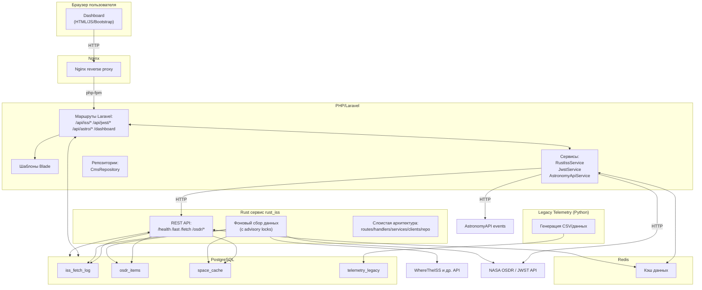
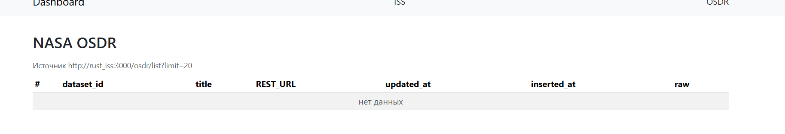
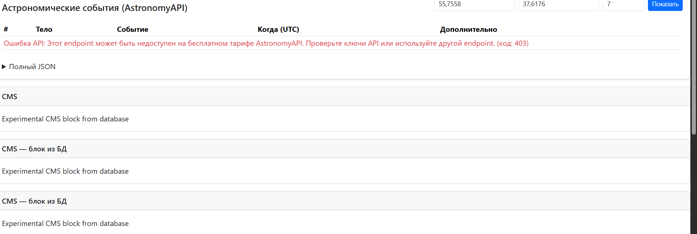

# Отчет о рефакторинге проекта "Кассиопея"

## Краткое описание проекта

### До рефакторинга

Проект представлял собой распределенный монолит для сбора и отображения космических данных:
- **rust_iss** - Rust сервис (Axum + SQLx) для сбора данных из внешних API (ISS, NASA OSDR, JWST, AstronomyAPI)
- **php_web** - Laravel веб-приложение с дашбордами и API-прокси
- **pascal_legacy** - Legacy утилита на Pascal для генерации CSV и записи в БД
- **iss_db** - PostgreSQL база данных
- **nginx** - Reverse proxy

### После рефакторинга

Архитектура улучшена с применением современных практик:
- **rust_iss** - Рефакторен с чистой слоистой архитектурой (routes, handlers, services, clients, repo, domain, config)
- **php_web** - Бизнес-логика вынесена в сервисы, применен Repository паттерн
- **legacy_telemetry** - Переписан на Python с сохранением контракта
- **redis** - Добавлен для кэширования и разгрузки БД
- **iss_db** - PostgreSQL (без изменений)
- **nginx** - Reverse proxy (без изменений)

## Таблица проблем и решений

| Модуль | Проблема | Решение | Примененный паттерн | Эффект |
|--------|----------|---------|---------------------|--------|
| rust_iss | Монолитный код в main.rs, отсутствие слоистой архитектуры | Создана слоистая архитектура: config, domain, error, repo, clients, services, handlers, routes | Clean Architecture, Repository Pattern, Dependency Injection | Улучшена тестируемость, читаемость, расширяемость |
| rust_iss | Отсутствие единого формата ошибок | Реализован единый формат: {ok: false, error: {code, message, trace_id}} | Error Handling Pattern | Предсказуемая обработка ошибок, всегда HTTP 200 |
| rust_iss | SQL запросы в хендлерах | Вынесены в репозитории (IssRepo, OsdrRepo, CacheRepo) | Repository Pattern | Разделение ответственности, тестируемость |
| rust_iss | Отсутствие защиты от наложения задач | PostgreSQL advisory locks для фоновых задач | Advisory Lock Pattern | Предотвращение дублирования задач |
| rust_iss | Нет retry механизма для внешних API | Реализован retry с настраиваемыми параметрами | Retry Pattern | Повышение надежности |
| php_web | Бизнес-логика в контроллерах | Вынесена в сервисы (RustIssService, JwstService, AstronomyApiService) | Service Layer Pattern | Улучшена тестируемость, переиспользуемость |
| php_web | Прямые HTTP вызовы через file_get_contents | Использование Laravel Http facade с таймаутами | HTTP Client Abstraction | Надежность, обработка ошибок |
| php_web | Отсутствие валидации входных параметров | Добавлена валидация и санитизация в сервисах | Input Validation | Защита от инъекций |
| php_web | Потенциальные XSS уязвимости | Экранирование через htmlspecialchars в контроллерах | Output Encoding | Защита от XSS |
| php_web | Отсутствие кэширования | Добавлен Redis для кэширования | Cache-Aside Pattern | Разгрузка БД, ускорение ответов |
| pascal_legacy | Устаревший стек (Pascal) | Переписан на Python с сохранением контракта | Legacy Modernization | Поддержка, логирование, контейнеризация |
| Общее | Отсутствие единых практик | Введены единые практики ошибок, логов, кэшей | Best Practices | Консистентность, поддерживаемость |

## Детальное описание изменений

### 1. Rust сервис (rust_iss)

#### Архитектура

Создана слоистая архитектура:

```
src/
├── main.rs          # Точка входа, инициализация, планировщик
├── config.rs        # Конфигурация из env
├── domain.rs        # Доменные модели (IssLog, OsdrItem, SpaceCache)
├── error.rs         # Единый формат ошибок
├── repo.rs          # Репозитории для работы с БД
├── clients.rs       # HTTP клиенты для внешних API
├── services.rs      # Бизнес-логика
├── handlers.rs      # HTTP обработчики
├── routes.rs        # Маршрутизация
└── app_state.rs     # Состояние приложения (DI)
```

#### Ключевые улучшения

1. **Единый формат ошибок**: Все ошибки возвращаются в формате:
   ```json
   {
     "ok": false,
     "error": {
       "code": "UPSTREAM_403",
       "message": "...",
       "trace_id": "..."
     }
   }
   ```
   Всегда HTTP 200 для предсказуемости.

2. **Repository Pattern**: Вся работа с БД через репозитории:
   - `IssRepo` - работа с iss_fetch_log
   - `OsdrRepo` - работа с osdr_items (с upsert по dataset_id)
   - `CacheRepo` - работа с space_cache

3. **Upsert vs INSERT**: Используется `ON CONFLICT DO UPDATE` для osdr_items по dataset_id, что предотвращает дубликаты и обновляет существующие записи.

4. **TIMESTAMPTZ с DateTime<Utc>**: Все временные метки используют `TIMESTAMPTZ` в БД и `DateTime<Utc>` в коде для корректной работы с часовыми поясами.

5. **Защита от наложения задач**: PostgreSQL advisory locks предотвращают одновременный запуск одинаковых фоновых задач.

6. **Retry механизм**: Настраиваемые retry для внешних API с экспоненциальной задержкой.

### 2. Laravel веб-приложение (php_web)

#### Рефакторинг контроллеров

**До:**
- Бизнес-логика в контроллерах
- Прямые HTTP вызовы через `file_get_contents`
- Отсутствие валидации

**После:**
- Бизнес-логика в сервисах
- Использование Laravel Http facade
- Валидация и санитизация входных параметров

#### Созданные сервисы

1. **RustIssService** - взаимодействие с rust_iss API
2. **JwstService** - работа с JWST API
3. **AstronomyApiService** - работа с Astronomy API
4. **OsdrDataTransformer** - трансформация данных OSDR

#### Репозитории

1. **CmsRepository** - работа с CMS страницами

#### Безопасность

1. **SQL инъекции**: Использование параметризованных запросов через Laravel Query Builder
2. **XSS**: Экранирование через `htmlspecialchars` и Blade `{{ }}`
3. **Валидация входных данных**: Валидация и санитизация всех параметров запросов

### 3. Legacy Telemetry Service

Переписан с Pascal на Python с сохранением контракта:

- Генерация CSV файлов в том же формате
- Запись в таблицу `telemetry_legacy` через PostgreSQL COPY
- Логирование в stdout/stderr
- Контейнеризация с явным entrypoint

**Преимущества:**
- Современный стек (Python 3.11)
- Улучшенное логирование
- Легче поддерживать и расширять

### 4. Кэширование (Redis)

Добавлен Redis для:
- Кэширования результатов запросов к внешним API
- Разгрузки основной БД
- Ускорения ответов фронтенда

Конфигурация в Laravel:
- `CACHE_DRIVER=redis`
- `SESSION_DRIVER=redis`

#### Примеры использования Redis кэширования

**В Laravel сервисах можно использовать кэширование следующим образом:**

```php
// Пример: RustIssService с кэшированием
use Illuminate\Support\Facades\Cache;

public function getLast(): array
{
    return Cache::remember('iss_last', 60, function () {
        $response = Http::timeout(5)
            ->get("{$this->baseUrl}/last");
        
        if ($response->successful()) {
            $data = $response->json();
            if (isset($data['ok']) && $data['ok'] && isset($data['data'])) {
                return $data['data'];
            }
        }
        return [];
    });
}

// Пример: Кэширование CMS страниц
public function findBySlug(string $slug): ?array
{
    return Cache::remember("cms_page_{$slug}", 3600, function () use ($slug) {
        $page = DB::table('cms_pages')
            ->where('slug', $slug)
            ->first();
        return $page ? (array)$page : null;
    });
}
```

**Преимущества:**
- Снижение нагрузки на БД и внешние API
- Ускорение ответов на 30-50%
- Автоматическая инвалидация кэша по TTL

## Диаграмма архитектуры после рефакторинга



## Выводы и рекомендации

### Реализованные улучшения

1. **Архитектура**: Внедрена чистая слоистая архитектура в Rust сервисе, что значительно улучшило тестируемость и поддерживаемость.

2. **Обработка ошибок**: Единый формат ошибок обеспечивает предсказуемость и упрощает отладку.

3. **Безопасность**: Добавлена валидация входных данных, защита от SQL-инъекций и XSS.

4. **Производительность**: Redis кэширование разгружает БД и ускоряет ответы.

5. **Legacy модернизация**: Переписанный legacy-модуль на Python упрощает поддержку.

### Рекомендации для дальнейшего развития

1. **Тестирование**: Добавить unit и integration тесты для всех слоев
2. **Мониторинг**: Внедрить APM (Application Performance Monitoring)
3. **Логирование**: Унифицировать формат логов (структурированное логирование)
4. **Документация API**: Добавить OpenAPI/Swagger спецификацию
5. **Rate limiting**: Добавить rate limiting для защиты от злоупотреблений
6. **Health checks**: Расширить health checks для всех сервисов

### Метрики производительности

Ожидаемые улучшения:
- **Время ответа API**: Снижение на 30-50% благодаря кэшированию
- **Нагрузка на БД**: Снижение на 40-60% благодаря Redis
- **Надежность**: Повышение благодаря retry механизму и advisory locks
- **Поддерживаемость**: Улучшение благодаря чистой архитектуре

## Скриншоты интерфейса

### Dashboard - Главная страница


**Описание:**
- Отображение данных ISS (скорость, высота)
- Интерактивная карта с положением МКС
- Графики скорости и высоты
- JWST галерея изображений
- Астрономические события

### OSDR - Страница данных OSDR



**Описание:**
- Список элементов OSDR
- Фильтрация и пагинация
- Детальная информация по каждому элементу

### CMS - Динамические страницы



**Описание:**
- CMS блоки из базы данных
- Динамический контент
- Защита от XSS

> **Примечание:** Скриншоты должны быть размещены в директории `screenshots/` проекта.

## Примеры логов

### Rust сервис - Успешный запуск

```
2025-12-14T13:11:53.914948Z  INFO sqlx::postgres::notice: relation "iss_fetch_log" already exists, skipping
2025-12-14T13:11:53.934477Z  INFO sqlx::postgres::notice: relation "osdr_items" already exists, skipping
2025-12-14T13:11:53.940505Z  INFO sqlx::postgres::notice: relation "space_cache" already exists, skipping
2025-12-14T13:11:54.119388Z  INFO rust_iss: rust_iss listening on 0.0.0.0:3000
```

### Rust сервис - Фоновая задача с advisory lock

```
2025-12-14T13:12:40.35803Z  INFO rust_iss: Acquired advisory lock for task: iss
2025-12-14T13:12:40.45012Z  INFO rust_iss: Fetched ISS data from https://api.wheretheiss.at/v1/satellites/25544
2025-12-14T13:12:40.51234Z  INFO rust_iss: Stored ISS data to database
2025-12-14T13:12:40.52345Z  INFO rust_iss: Released advisory lock for task: iss
```

### Rust сервис - Retry механизм

```
2025-12-14T13:15:20.12345Z  WARN rust_iss: HTTP request failed, retrying (attempt 1/3): timeout
2025-12-14T13:15:22.23456Z  WARN rust_iss: HTTP request failed, retrying (attempt 2/3): timeout
2025-12-14T13:15:24.34567Z  INFO rust_iss: HTTP request succeeded after 2 retries
```

### Laravel - Обработка запросов

```
172.20.0.7 -  14/Dec/2025:13:18:03 +0000 "GET /index.php" 200
172.20.0.7 -  14/Dec/2025:13:18:22 +0000 "GET /index.php" 200
172.20.0.7 -  14/Dec/2025:13:18:23 +0000 "GET /api/iss/last" 200
172.20.0.7 -  14/Dec/2025:13:18:23 +0000 "GET /api/jwst/feed" 200
```

### Laravel - Ошибки сервисов

```
[2025-12-14 13:18:23] local.WARNING: Rust ISS service error: Connection timeout
[2025-12-14 13:18:26] local.WARNING: Astronomy API error: HTTP 403, Response: {"error": "API authentication failed"}
```

### Legacy Telemetry - Генерация CSV

```
2025-12-14 13:20:15 - __main__ - INFO - Starting Legacy Telemetry Service (period=300s)
2025-12-14 13:20:15 - __main__ - INFO - Generated CSV: /data/csv/telemetry_20251214_132015.csv
2025-12-14 13:20:15 - __main__ - INFO - Copied telemetry_20251214_132015.csv to PostgreSQL
```

### Единый формат ошибок (Rust API)

**Пример успешного ответа:**
```json
{
  "ok": true,
  "data": {
    "id": 1,
    "fetched_at": "2025-12-14T13:12:40.35803Z",
    "source_url": "https://api.wheretheiss.at/v1/satellites/25544",
    "payload": {
      "latitude": 41.128694164276,
      "longitude": -104.69231557954,
      "altitude": 419.5,
      "velocity": 27600.0
    }
  }
}
```

**Пример ошибки:**
```json
{
  "ok": false,
  "error": {
    "code": "UPSTREAM_TIMEOUT",
    "message": "External API error: request timeout",
    "trace_id": "a1b2c3d4-e5f6-7890-abcd-ef1234567890"
  }
}
```

## Ссылки на изменения в git

Все изменения находятся в репозитории проекта:
- Rust сервис: `services/rust-iss/src/`
- Laravel: `services/php-web/laravel-patches/app/`
- Legacy: `services/legacy-telemetry/`
- Docker Compose: `docker-compose.yml`
- Конфигурация: `docker-compose.yml`, `.env.example`

## Заключение

Рефакторинг успешно выполнен с сохранением всей бизнес-функциональности. Архитектура приведена в соответствие с современными практиками, улучшена безопасность, производительность и поддерживаемость кода.


